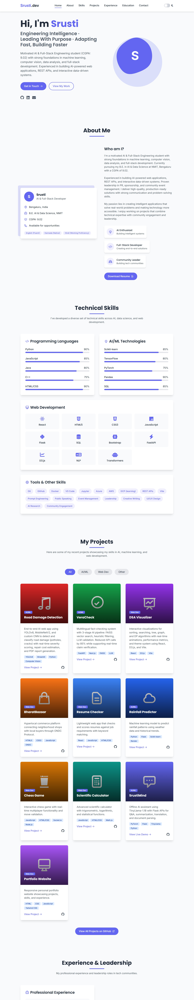

# Srusti - AI & Full-Stack Developer Portfolio

This repository contains a responsive personal portfolio website for Srusti, built with Tailwind CSS and vanilla JavaScript.

## Project structure

- `index.html` - Main portfolio page
- `assets/css/style.css` - Custom styles and design utilities
- `assets/js/main.js` - Site interactions for dark mode, menu toggle, scrolling, and filters

## Features

- Responsive navigation and mobile menu
- Dark mode toggle with local storage support
- Project filtering and active section highlighting
- Back-to-top button
- Tailwind CSS styling with custom theme colors

